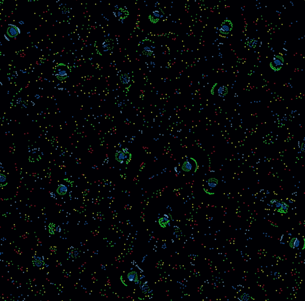

## Introduction

I am Piotr. I work on a research team at Warsaw University of Technology in the Artificial Intelligence department, with a focus on multi-agent and emergent controllers (with some exploration into evolutionary techniques). 

Through out my career I was extremely interested in different evolutionary algorithms and emergent structures. These led me to implementing NEAT in JAX (https://github.com/PeterWaIIace/NEAT/tree/main) or making my own implementation of particle life (https://github.com/PeterWaIIace/ParticleLife). 

But most of them were mostly my personal projects. More here: https://github.com/PeterWaIIace 

# Follow my updates:

### swarm's
- [[24.09.2025 Building Swarm Environment]] 