A genetic algorithm is biologically inspired method for finding best solution (optimization). It takes its inspiration from what we know about evolution and genomes.

It searches for best solution by creating population of random candidates and evolving them over generations based on best score fitness. Genetic algorithm starts with random population of candidate genomes and then over epochs updates population with small noise or genomes cross-over or both. 

1. Initialization

The algorithm begins by generating an initial population of possible solutions. Each solution is represented as a genome, which contains all the information needed to describe that solution. The initial population is often created randomly to provide diversity and allow exploration of different solution possibilities.

2. Fitness Evaluation

Each genome in the population is evaluated using a fitness function. The fitness function measures how well a genome performs with respect to the problem objective. Genomes with higher fitness values represent better solutions and are more likely to contribute to future generations.

3. Selection

In this step, genomes are selected from the current population to serve as parents for generating new solutions. The selection process favors genomes with higher fitness while maintaining enough diversity to avoid losing potentially useful genetic information.

4. Crossover

Crossover combines genetic information from two or more selected parent genomes to create new offspring genomes. This process allows beneficial characteristics from different solutions to be combined, potentially producing better solutions than the parents.

5. Mutation

Mutation introduces small random changes into the genetic information of offspring genomes. This helps maintain diversity within the population and enables the algorithm to explore new regions of the solution space that may not be reached through crossover alone.

6. Replacement

The newly generated offspring genomes replace some or all of the existing population to create the next generation. The algorithm then repeats the cycle of fitness evaluation, selection, crossover, mutation, and replacement until a termination condition is reached or a satisfactory solution is found.

## Paper: 

https://www.ceas3.uc.edu/ret/archive/2018/ret/docs/readings/Project%203/2018RET_ReadingMaterial_Introduction%20to%20Genetic%20Algorithms.pdf